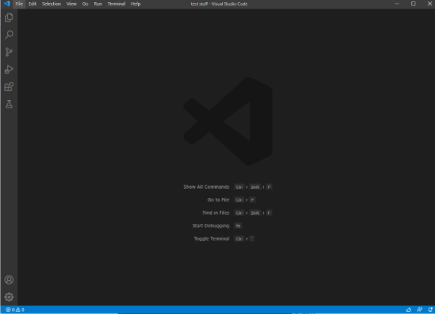
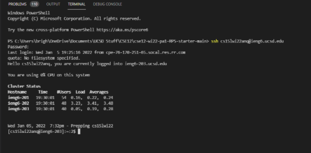
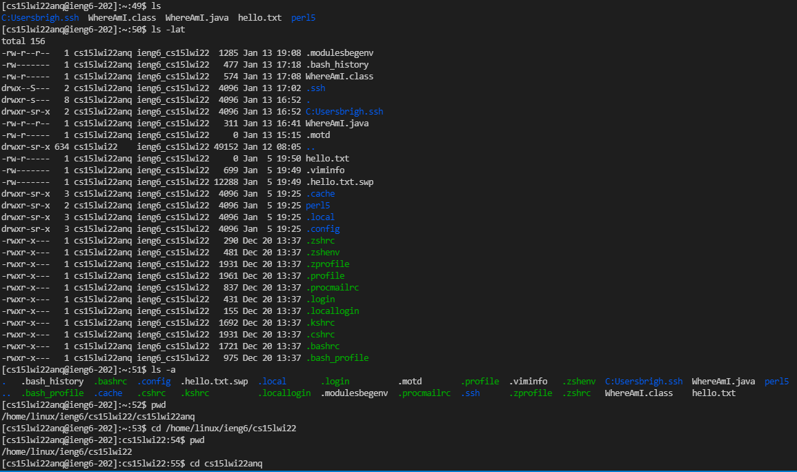
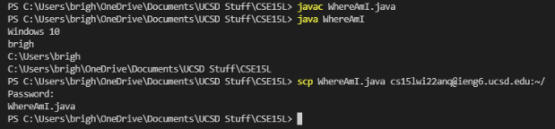
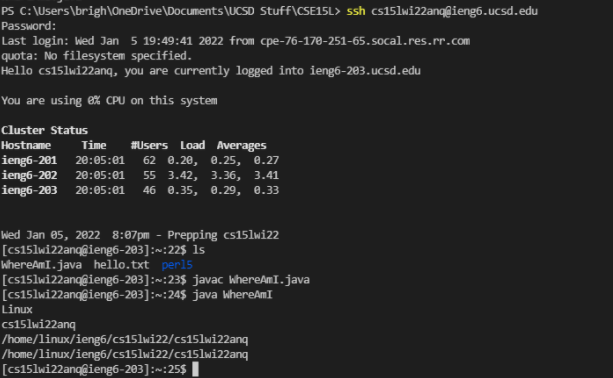
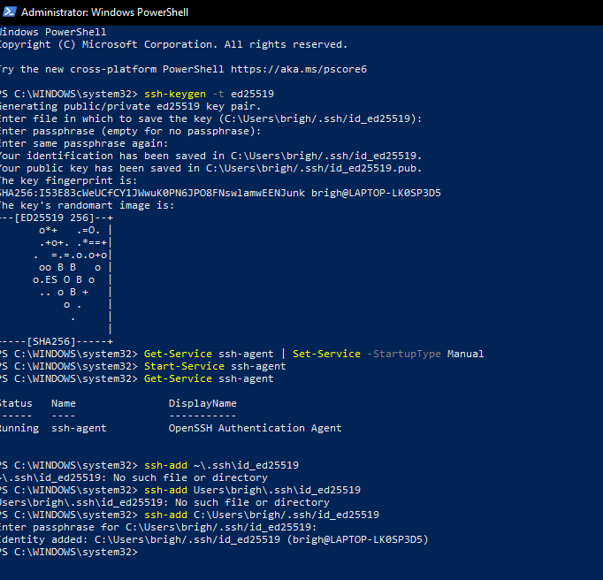
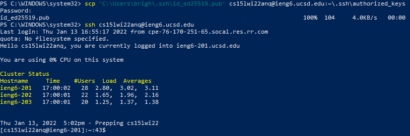
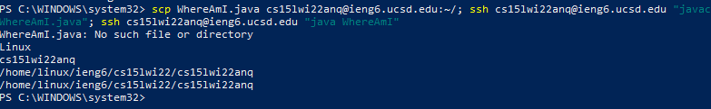

Brighten Hayama (A16906699)
# **CSE15L Lab Report 1 - Week 2**

## Part 1 - Installing VScode:

* Went to [https://code.visualstudio.com/](https://code.visualstudio.com/)
* Completed installation and opened the main screen above

  

## Part 2 - Remotely Connecting:

* `$ ssh cs15lwi22anq@ieng6.ucsd.edu` - This should be a course-specific account, with last 3 letters "anq" unique to me
* Enter password when prompted (this text doesn't show in the terminal)
* This connects client to the remote server

  

## Part 3 - Trying Some Commands:

**A few of the commands that I tried:**
* `ls` to list files or directories
* `ls -lat` to list the latest-edited files or directories
* `ls -a` to list hidden directories horizontally
* `pwd` to print current working directory
* `cd <directory>` to move between directories, or `cd ~` to return to the default directory

  

## Part 4 - Moving Files with scp:

* Here, I compiled and ran a java file locally
* I then used `scp` on my client to move the file onto the remote server.

* Used `ls` to list files and WhereAmI.java appeared
* Can now run this file on the remote server

  

## Part 5 - Setting an SSH Key:

* Needed to use admin powershell for permissions
* Created a public and private key with `ssh-keygen`
* Securely stored the private key, and copied the public key onto .ssh directory
* The commands for setting ssh key on windows was found [here](https://docs.microsoft.com/en-us/windows-server/administration/openssh/openssh_keymanagement#user-key-generation)

* This shows the working `ssh` key
* Skipped the password prompt and accessed the remote client much quicker

  

## Part 6 - Optimizing Remote Running:

* Able to combine multiple commands in one line using semicolons
* I was able to `scp` the file onto the remote server, then compile/run the code by logging into ssh using the ssh key.
* After entering this series of commands once, I can use the up-arrow to combine all of these steps in one key press.

