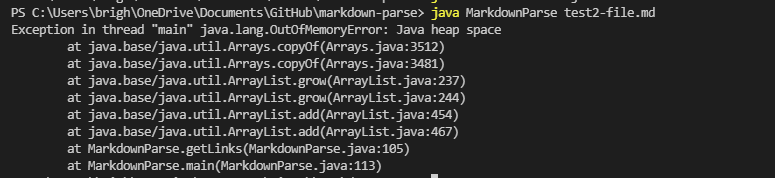
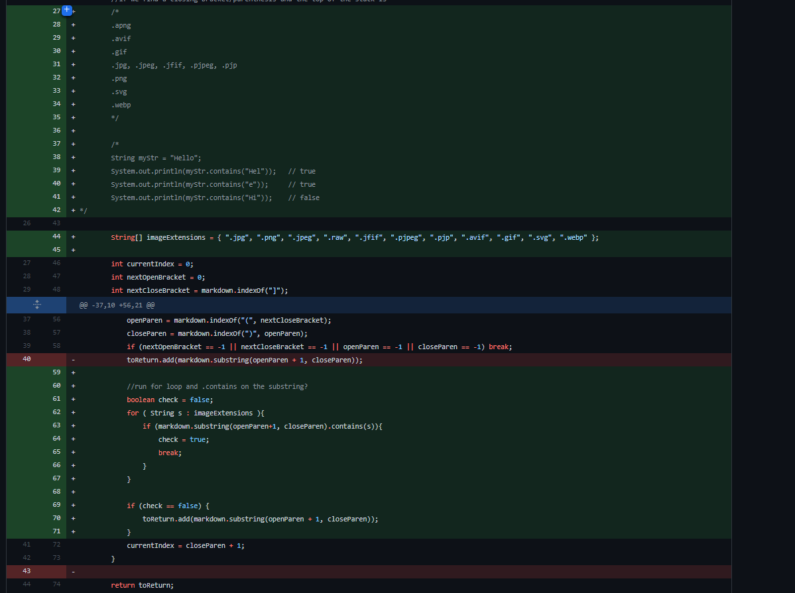
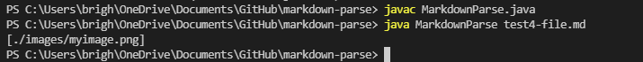
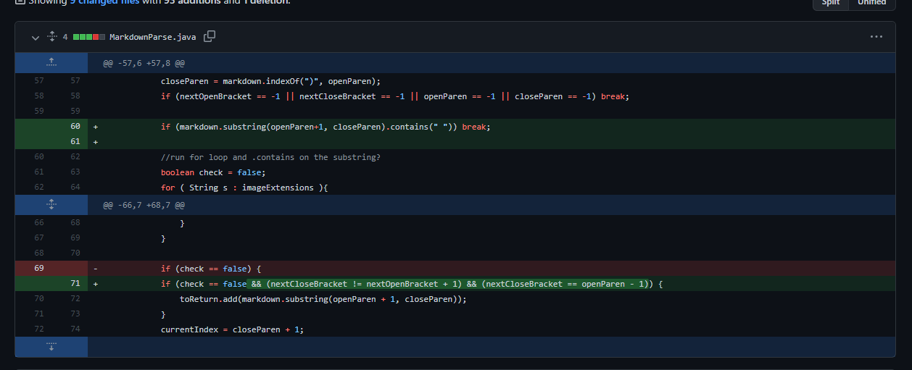
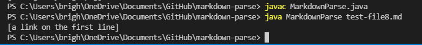

Brighten Hayama (A16906699)
# **CSE15L Lab Report 2 - Week 4** 

## Code Change #1:

1. Test file of failure-inducing input: [https://brighyama.github.io/markdown-parse/test2-file.md](https://brighyama.github.io/markdown-parse/test2-file.md)
2. Symptom: infinite loop

3. The first failure-inducing input was test2-file.md, in which the order of the parenthesis and brackets were changed. The symptom that occured because of this was an infinite loop until an OutOfMemoryError was thrown. We found the bug to be in the while loop's indexOf() statements, where the calculation of currentIndex never exceeded markdown.length() due to the order of parenthesis and brackets.
  

## Code Change #2:

1. Test file of failure-inducing input: [https://brighyama.github.io/markdown-parse/test4-file.md](https://brighyama.github.io/markdown-parse/test4-file.md)
2. Symptom: returning an image

3. This failure-inducing input was test4-file.md, where the link formatting was correct, but the parenthesis contained an image instead of a working link. As a result, the symptom of this input was the image being returned from the markdown parse. We determined that the bug was the while loop's conditionals for breaking because the markdown parse correctly determined the order of parenthesis and brackets, but returned whatever was inside of the parenthesis regardless if it was a link or image. 
  

## Code Change #3:

1. Test file of failure-inducing input: [https://brighyama.github.io/markdown-parse/test-file8.md](https://brighyama.github.io/markdown-parse/test-file8.md)
2. Symptom: returning something that isn't a link

3. The last failure-inducing input was test-file8.md, where the formatting was correct, but the link itself was not a link. The symptom of this input was the phrase being returned, when it shouldn't have. The bug was the while loop's lack of conditional checks for the contents of the parenthesis.