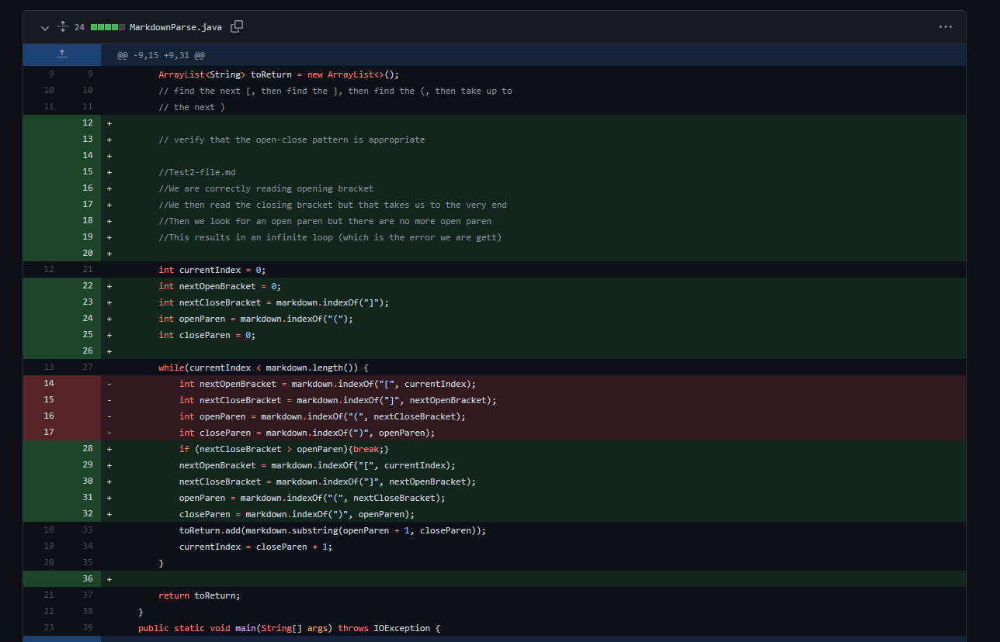

Brighten Hayama (A16906699)
# **CSE15L Lab Report 2 - Week 4** 

## Code Change #1:

1. Test file of failure inducing input: [https://brighyama.github.io/markdown-parse/test2-file.md](https://brighyama.github.io/markdown-parse/test2-file.md)
2. Symptom: 
3. 
  

## Code Change #2:

1. Test file of failure inducing input: [https://brighyama.github.io/markdown-parse/test4-file.md](https://brighyama.github.io/markdown-parse/test4-file.md)
2. Symptom: 
3. 
  

## Code Change #3:

1. Test file of failure inducing input: [https://brighyama.github.io/markdown-parse/test-file8.md](https://brighyama.github.io/markdown-parse/test-file8.md)
2. Symptom: 
3. 