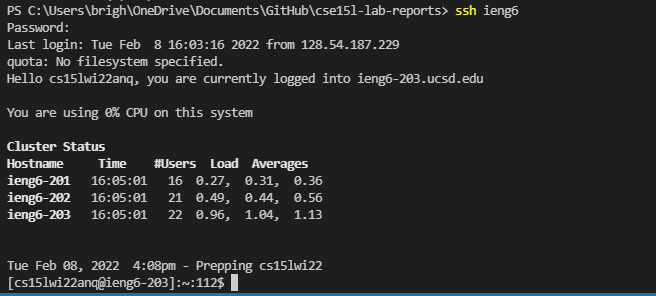

Brighten Hayama (A16906699)
# **CSE15L Lab Report 3 - Week 6** 

* I opened the .ssh file in VSCode and created a new file called config. I pasted the configuration into the file and changed the user to my personal account. I decided to keep the alias the same.
  
---

* I used the `ssh` command with the new alias and logged in to the remote server.
  
---

* I used `scp` with the file name and the new alias to copy the file onto the remote server. I logged in and used `ls` to check that the file was copied over.
