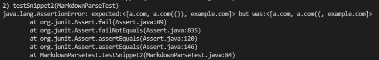

Brighten Hayama (A16906699)
# **CSE15L Lab Report 3 - Week 6** 

[My markdown-parse repository](https://github.com/brighyama/markdown-parse)

[Reviewed markdown-parse repository](https://github.com/RyanRongY/markdown-parse)

<br/><br/>

## Snippet 1:
```
`[a link`](url.com)

[another link](`google.com)`

[`cod[e`](google.com)

[`code]`](ucsd.edu)
```

* Preview:

    

* This snippet should produce [`google.com, google.com, ucsd.edu] from MarkdownParse
* Snippet 1 test:

    

* My implementation failed the test. Here is the corresponding JUnit output:

    

* Reviewed implementation failed the test. Here is the corresponding JUnit output:

    

* **Code Changes:** I don't think there is a small code change that can fix this issue. It should check for where the backticks are on each side of the brackets and parenthesis. It should also check for whether the pair of backticks are both within a set of brackets/parenthesis, or one outside/one inside. There are multiple cases that can cause the link to have valid formatting versus invalid formatting depending on the location of backticks in relation to other backticks.

<br/><br/>
## Snippet 2:

```
[a [nested link](a.com)](b.com)

[a nested parenthesized url](a.com(()))

[some escaped \[ brackets \]](example.com)
```

* Preview

    

* This snippet should produce [a.com, a.com(()), example.com] from MarkdownParse
* Snippet 2 test:

    

* My implementation failed the test. Here is the corresponding JUnit output:

    

* Reviewed implementation failed the test. Here is the corresponding JUnit output:

    

* **Code Changes:** I think the code change to fix the nested brackets/parentheses would be more involved than 10 lines of code. One solution could be to use a stack and find matching pairs of  brackets/parentheses, but there are many cases to account for in determining if the brackets/parentheses should be considered simple text or new link formatting.

<br/><br/>
## Snippet 3:

```
[this title text is really long and takes up more than 
one line

and has some line breaks](
    https://www.twitter.com
)

[this title text is really long and takes up more than 
one line](
    https://ucsd-cse15l-w22.github.io/
)


[this link doesn't have a closing parenthesis](github.com

And there's still some more text after that.

[this link doesn't have a closing parenthesis for a while](https://cse.ucsd.edu/


)

And then there's more text
```

* Preview:

    

* This snippet should produce [https://ucsd-cse15l-w22.github.io/] from MarkdownParse
* Snippet 3 test:

    

* My implementation failed the test. Here is the corresponding JUnit output:

    

* Reviewed implementation failed the test. Here is the corresponding JUnit output:

    

* **Code Changes:** I think this bug could be fixed in relatively short code, because it just involves checking if 1 or more line breaks separates the link formatting. If the link continues onto the next line or is indented once, like in the case of the correct link above, it can be considered a valid link. Whereas if there are any more linebreaks in between, then it won't be returned from getLinks.