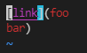
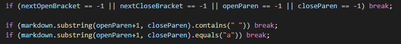
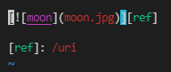
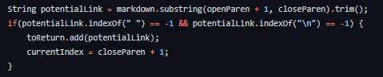

Brighten Hayama (A16906699)
# **CSE15L Lab Report 5 - Week 10** 

* I found differences in my implementation and the provided implementation using
 `diff markdown-parse-lab9/markdown-parse-main/results.txt my-markdown-parse/results.txt` in the terminal, which finds differences in each file named "results.txt". This command listed out the line numbers of the different outputs of markdown parse, so I navigated to each file in the terminal and used `vim results.txt` to locate these line numbers and the test files that produced that output.

  

## Diff 1: Test 489
Test file:

Diff outputs:

* The given implementation produced the correct output because the test file includes a line break in the parentheses. So the correct output should be an empty array. My code added the contents, including the line break, to the returned array.

* The problem with my code is that there is no condition that checks for a line break. The image below shows several conditions that break from the outer while loop, but they do not check for line breaks, whereas the given implementation does.

  

## Diff 2: Test 530
Test file:

Diff outputs:

* My implementation produced the correct output. The test file contains an image extension ".jpg", which is not considered a valid link, so the correct output is an empty array. The given implementation doesn't check for image extensions before returning, so it returned "moon.jpg" in the array.

* The problem with the given markdown parse is with its conditions for checking the content inside of the parentheses. In the image of the code below, it checks for spaces and line breaks before adding a link, but it doesn't check for image extensions.

